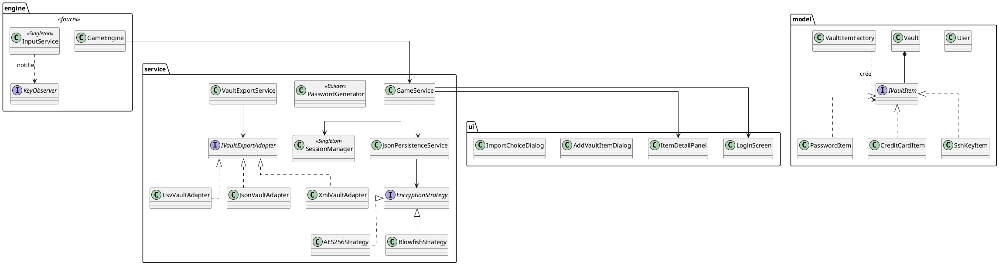

# Document de réversibilité technique

> Ce document est destiné à l'équipe qui reprendra la maintenance du projet. Soyez honnêtes et exhaustifs. Pas d'enjolivement.

## Architecture actuelle

Le projet suit une architecture en 3 couches : UI (présentation) → Service (logique métier + chiffrement) → Persistence (fichiers JSON chiffrés). L'injection de dépendances est gérée par Google Guice, configuré dans `AppModule`.

**Flux d'exécution :**
1. `App.java` crée l'injecteur Guice et initialise la fenêtre JavaFX.
2. `GameEngine.start()` appelle `GameService.init()` une fois, puis `GameService.update()` à chaque frame (~60 fps) via un `AnimationTimer`.
3. `GameService` affiche soit `LoginScreen` (si non connecté), soit la vue coffre-fort (3 colonnes : sidebar, liste, détail).
4. `LoginScreen` hache le mot de passe (SHA-512), dérive la clé de chiffrement, et stocke l'état dans `SessionManager`.
5. `JsonPersistenceService` sérialise le coffre en JSON, chiffre les octets, encode en Base64, et écrit dans `storage/vault_{userId}.json`.

## Bugs connus

| Bug | Sévérité | Conditions de reproduction |
|-----|----------|---------------------------|
| La dérivation de clé AES utilise les 16 premiers octets du hash SHA-512 du mot de passe — pas de sel ni de KDF (PBKDF2/Argon2). Un attaquant disposant du fichier vault peut tenter un dictionnaire hors-ligne sans coût computationnel. | Majeure (sécurité) | Toujours présent. Concerne tous les comptes créés avec AES-256. |
| AES est utilisé sans IV (vecteur d'initialisation) : deux chiffrements du même texte produisent le même chiffré. Facilite les attaques par analyse de fréquences sur des vaults similaires. | Majeure (sécurité) | Toujours présent. Visible en inspectant `AES256Strategy.java`. |
| `users.json` stocke les comptes en clair (email + hash SHA-512 du mot de passe maître). Un accès au fichier expose les emails et permet des attaques par dictionnaire sur les hashs. | Modérée | Toujours présent. Fichier `storage/users.json` lisible sans droits particuliers. |
| `Vault.loadAndDecryptAll()` le déchiffrement élément par élément (décrit dans le diagramme de séquence de conception) n'est pas implémenté. Le chiffrement se fait au niveau du vault entier dans `JsonPersistenceService`. | Mineure (écart conception/code) | Toujours présent. Appeler `vault.loadAndDecryptAll()` ne fait rien. |
| Si le fichier `storage/` est absent au premier lancement, `JsonPersistenceService` peut lever une exception non gérée selon l'OS. | Mineure | Lancer l'application après avoir supprimé le dossier `storage/`. |

## Limitations techniques

- **Dérivation de clé** : Il faudrait utiliser PBKDF2 (disponible dans `javax.crypto`) ou Argon2 (bibliothèque externe) avec un sel unique par utilisateur.
- **Pas d'analyse de force des mots de passe** : la fonctionnalité est mentionnée dans le pitch mais absente du code. Les données sont disponibles (`IVaultItem.getDescription()`, champs `password`), il manque le moteur d'analyse.
- **Type `NoteItem` absent** : le pitch parle de la possibilité de stocker des notes confidentielles et des codes de récupération, mais seuls `PasswordItem`, `CreditCardItem` et `SshKeyItem` existent. L'architecture `IVaultItem` + `VaultItemFactory` est prête à l'accueillir.
- **Pas de verrouillage automatique** : `SessionManager` contient `lastActivity` mais aucune vérification d'expiration de session n'est implémentée.
- **Tests limités** : seul `JsonPersistenceServiceTest` couvre la persistance. Aucun test sur `EncryptionStrategy`, `PasswordGenerator`, `VaultItemFactory`, ni sur les adapters d'import/export.

## Points de vigilance pour la reprise

- **Ne pas modifier les fichiers `engine/`** : `GameEngine`, `InputService` et `KeyObserver` constituent le socle fourni et ne doivent pas être modifiés. Toute logique passe par `GameService`.
- **`SessionManager` est `@Singleton` Guice (eager)** : ne pas l'instancier manuellement avec `new`. Toujours l'injecter. Plusieurs instances provoqueraient des états de session incohérents.
- **Polymorphisme Jackson sur `IVaultItem`** : la désérialisation des items du vault sont sur l'annotation `@JsonTypeInfo` de `IVaultItem`. Si il y a un nouveau type, il doit être déclaré dans `@JsonSubTypes`, sinon Jackson ne sait pas l'instancier et lève une exception à la lecture du vault.
- **Clé de chiffrement en mémoire** : `SessionManager.decryptionKey` est un `SecretKey` Java conservé en mémoire pendant toute la session. Il n'est pas explicitement effacé à la déconnexion.
- **Format de stockage** : `storage/vault_{UUID}.json` contient un objet JSON `{ "encryptedData": "...<base64>..." }`. Modifier le format sans migration cassera les vaults existants.
- **`EncryptionStrategyFactory`** : la sélection de stratégie se fait par correspondance de nom (`contains("Blowfish")`). Ajouter une nouvelle stratégie exige d'étendre ce factory et de l'enregistrer dans `AppModule`.

## Améliorations recommandées

| Amélioration | Difficulté | Justification |
|--------------|------------|---------------|
| Remplacer la dérivation de clé par PBKDF2 avec sel | Moyen | Bloque les attaques par dictionnaire hors-ligne sur les fichiers volés |
| Ajouter le type `NoteItem` (note libre chiffrée) | Facile | Architecture prête (`IVaultItem` + `VaultItemFactory`), extension directe |
| Implémenter l'analyse de force des mots de passe | Facile | Données déjà accessibles ; ajouter une classe `PasswordStrengthAnalyzer` suffit |
| Verrouillage automatique après inactivité | Facile | `SessionManager.lastActivity` existe déjà ; ajouter une vérification dans `GameService.update()` |
| Ajouter des tests unitaires sur `EncryptionStrategy` et `PasswordGenerator` | Facile | Les deux classes sont pures (sans dépendances JavaFX) et faciles à tester isolément |
| Ajouter des tests d'intégration sur les adapters CSV/JSON/XML | Moyen | Couvre les chemins d'import/export qui sont actuellement non testés |
| Chiffrer `users.json` ou n'y stocker que des identifiants opaques | Moyen | Évite d'exposer les emails et les hashs en clair sur le disque |

